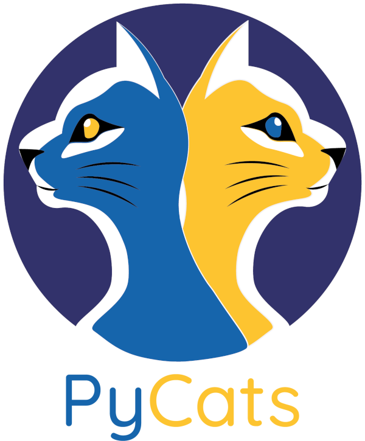
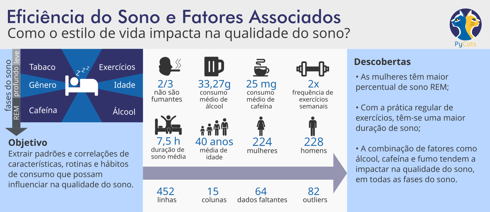

<div align="center">
    
</div>

# Análise da Eficiência do Sono


 [](http://pypi.org/project/atlantico-academy-equipe2-2024.1/) [](https://github.com/atlantico-academy/equipe1-2024.2/commit/developer)

## Base de Dados
- [Sleep Efficience](https://www.kaggle.com/datasets/equilibriumm/sleep-efficiency)

## Objetivo do Projeto

<p align="justify"> Este projeto tem como objetivo analisar e identificar padrões e correlações entre a eficiência do sono e aspectos diversos, como rotina e hábitos de consumo, que possam oferecer informações valiosas sobre os fatores que influenciam a qualidade do sono. A base de dados Sleep Efficience, disponível no Kaggle, inclui informações sobre idade, gênero, horários de dormir e acordar, duração do sono, porcentagem de sono leve, profundo e REM, número de despertares, consumo de cafeína e álcool, status de tabagismo e frequência de exercícios.</p>

## Justificativa do Projeto

<p align="justify"> A qualidade do sono é vital para a saúde e o bem-estar físico, mental e emocional. Problemas de sono podem causar distúrbios mentais, doenças cardiovasculares e baixa produtividade. Identificar fatores que afetam a eficiência do sono, como idade, gênero, horários de dormir, duração do sono, porcentagens de sono REM (profundo e leve), despertares, consumo de cafeína e álcool, tabagismo e exercícios, pode ajudar a criar estratégias para melhorar o sono e a saúde geral. Este projeto analisa dados diversificados com o propósito de encontrar padrões úteis para profissionais de saúde, pesquisadores e o público em geral, a fim de fornecer uma base sólida para intervenções personalizadas.</p>

## Resumo Gráfico
<div align="center">
    
</div>


## Desenvolvedores
 - [Beatriz Eduão](https://github.com/beduao)
 - [Gessyca Moraes](https://github.com/gessycamayhara)
 - [Kesava Menezes](https://github.com/KesavaS2)
 - [Ricardo Franco](https://github.com/francocontigo)
 - [Vitor Pires](https://github.com/vikpires)
 
 ## Organização de Diretórios
 
```
├── data/              # Diretório contendo todos os arquivos de dados
│   ├── external/      # Arquivos de dados de fontes externas
│   ├── interim/       # Arquivos de dados intermediários
│   ├── processed/     # Arquivos de dados processados
│   └── raw/           # Arquivos de dados originais, imutáveis
├── docs/              # Documentação gerada através da biblioteca mkdocs
├── models/            # Modelos treinados e serializados, predições ou resumos de modelos
├── notebooks/         # Diretório contendo todos os notebooks utilizados nos passos
├── references/        # Dicionários de dados, manuais e todo o material exploratório
├── src/               # Código fonte utilizado nesse projeto
│   ├── data/          # Classes e funções utilizadas para download e processamento de dados
│   ├── deployment/    # Classes e funções utilizadas para implantação do modelo
│   └── model/         # Classes e funções utilizadas para modelagem
├── app.py             # Arquivo com o código da aplicação do streamlit
├── Procfile           # Arquivo de configuração do heroku
├── pyproject.toml     # Arquivo de dependências para reprodução do projeto
├── poetry.lock        # Arquivo com sub-dependências do projeto principal
├── README.md          # Informações gerais do projeto
└── tasks.py           # Arquivo com funções para criação de tarefas utilizadas pelo invoke
```